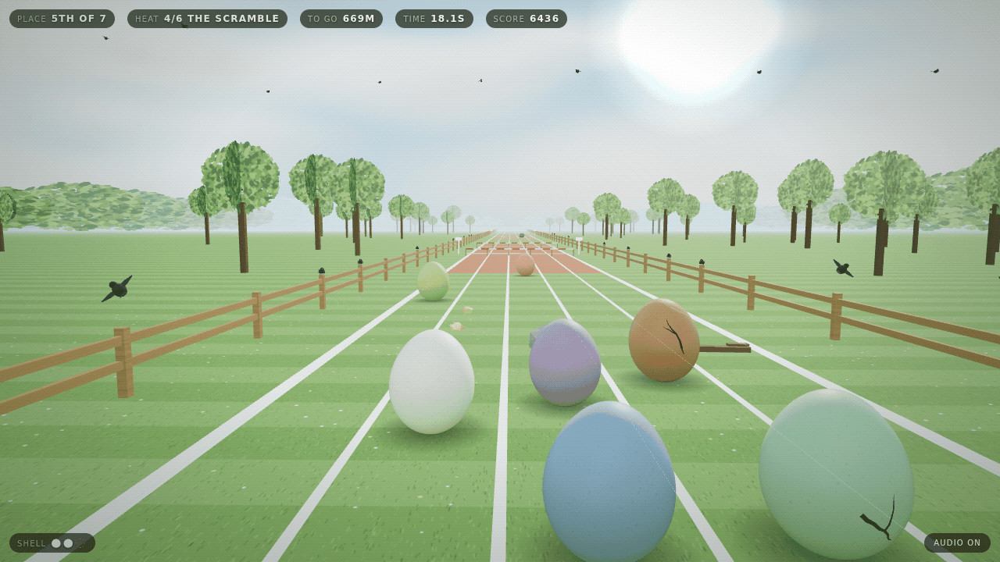
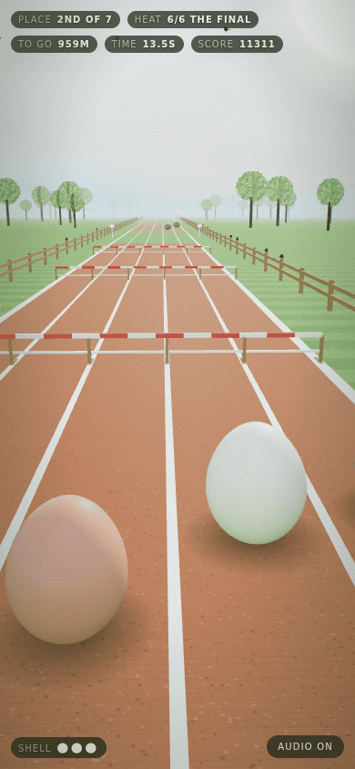

# Runny Egg

Six eggs to a field, five lanes, and a bar across all of them. You are not the
fastest one out there. You are the one that has to arrive in one piece.

A 3D racing game in the browser: run the card, jump the hurdles, miss the
stones, mind the other eggs, and try to finish a heat without going over.
Three cracks and the shell lets go.

The egg is [Marc's](https://github.com/h1ddenpr0cess20/marc), as he is — the
same 128×96 shell through the same `shapeEgg` profile, the same 900-speckle
cream skin, the same physical material with its clearcoat and sheen. The rest
of the field is the same egg with a wash over it: the dye multiplies the cream
rather than replacing it, so the speckles show through and they are eggs
instead of billiard balls. Nobody is more than eight per cent bigger than
anybody else, which is enough to feel in a collision and not enough to be
unfair.

They all stay upright, too. The silhouette — fat end down, narrow end up — is
the asset, so they rock and turn on the spot instead of tumbling end over end.
The one thing that does put an egg over is going down, which is the point: an
egg on its side is an egg in trouble, readable from the back of the field at a
glance.



## Run

```sh
git clone https://github.com/h1ddenpr0cess20/runny-egg
cd runny-egg
npm install
npm run dev               # → http://localhost:5173
```

No API keys, no server, no account. It is a static page and three.js. Every
surface on the course — the turf, the dirt, the cinder, the timber, the bark,
the tree canopies, the clouds — is painted onto a canvas at boot, so there is
nothing to download but the code.

## Play

| | |
|---|---|
| `A` `D` / `←` `→` | one lane, per press |
| `W` / `↑` / `space` | jump — again in the air for a flail |
| `S` / `↓` | tuck — straight down off a bar, or a hand down mid-wobble |
| `M` | audio |

On a phone: swipe for a lane, flick up to jump, flick down to tuck, tap for a
jump.

### Three cracks

A stone trips you. A stone met at full pace, or met while you are still
wobbling from the last one, puts you down — and going down is what cracks a
shell. So is a bar taken badly, and so is another egg. Three of them and what
was inside you is on the grass, and that is the meet.

Another egg costs two shells, not one. A shoulder at that pace puts the pair of
you on the grass whoever came across whom, and what is still decided between
you is only who gets up first: the one that was already wobbling, or giving
away size, or catching the heels of the one in front, is the one lying there
watching the other go. There is nothing to be won by leaning on somebody.

The tuck is the answer to most of it. In the air it drops you twenty-two metres
a second, which is how you come off a hurdle without floating into the next
one. On the floor, mid-wobble, it is a hand down: the stumble is over, and it
costs you the speed you would have spent finishing it.

Between heats you are patched up. Within one, nothing is.

### What is worth going near

Crumbs are the currency and they are lying about everywhere, including in an
arc over a hurdle, which is the course telling you to jump. Four other things
turn up rather less often:

| | |
|---|---|
| **feather** | a surge of pace — and an egg with one on goes straight through the back of anybody in the way, which is what the feather gets spent on |
| **straw** | sure-footed: for a few seconds the whole track is flat and stones are something you crunch over |
| **puff** | light on your feet, so a bar is a formality |
| **patch** | one crack mended |

A feather through a rough stretch is a decision and not a present: whether a
stone trips you or fells you is the stone *and* the speed together, so the
thing that makes you fast is the thing that makes a middling stone dangerous.

### The card

Six heats, each one longer, quicker and better run than the last.

| | | |
|---|---|---|
| 1 | the warm-up | six eggs, a field, and nothing in the way but each other |
| 2 | the flat | the same again, quicker, and the groundsman has been slacking |
| 3 | first hurdles | bars across all five lanes; there is no way round one |
| 4 | the scramble | cross country — stones the size of your head |
| 5 | high hurdles | a rhythm race, and landing wrong once is arithmetic |
| 6 | the final | everything the meet has, at once |

Finish in the places and you run the next one. Finish outside them and the
meet goes on without you. The final takes everybody who gets round it, so
reaching it is the meet — and winning it is the gold.

A metre is a point, a crumb is twenty-five, an egg you get past is fifteen, and
a heat pays for the place you took it in, with a bonus for a shell you brought
home unmarked.

<p align="center">
  
</p>

## The rest of the field

The other eggs do not get a physics of their own. They write the same four
intents your hands do and hand them to the same `advance`, which is the only
honest way to run a race: when one of them beats you it is because it ran the
hurdle better, not because it was allowed to.

What they get instead of privileges is imperfection. Every egg has a nerve and
every heat has a skill, and everything they do is timed and aimed through the
product of the two. A nervous one in an early heat leaves a bar far too late
and meets it on the way up, and a bar met on the way up is a fall, and a fall
is a crack. Get three and the shell goes in front of everybody, and the slick
it leaves is on the track for the rest of the heat for the rest of the field to
run round — including you.

They also move over for no reason at all, every few seconds, because without
that the field runs the whole heat in the lanes it started in. Jockeying is
most of the contact in a race, and contact is most of what three cracks are
for. They do look first, mind — not always, and the nervous ones least of all,
but a shoulder cracks the egg that threw it as surely as the egg that took it,
and a field that never looked spent the meet crashing into itself.

## How it holds together

The race is a plain object graph with no pixels in it — track, field, cracks,
places — and the renderer reads a snapshot of it every frame. Nothing in
`src/core/` imports three.js or touches the DOM, which is why a seed can be
raced out headlessly in a test and asserted on.

```
index.html            Markup only — Vite's entry
src/
  main.js             The wiring, and nothing else
  styles.css          The HUD, the card and the board
  core/               The game. No three.js, no DOM, no randomness it did not seed
    race.js             Heats, cracks, collisions, places and the score
    track.js            A whole heat, laid at once: bars, stones, crumbs, prizes
    racer.js            One egg's physics — yours and everybody else's
    rivals.js           What the other eggs decide to press, and how badly
    roster.js           Who is in the field: a colour, a size and a nerve each
    tuning.js           Every number the race is tuned by — the track reads it too
    shape.js            Marc's egg profile, verbatim
    rng.js              A seeded stream, so a seed is a heat
    motion.js           The spring and the chase everything eases on
    emitter.js
  render/             three.js. Reads snapshots, owns no game state
    scene.js            Renderer, camera, haze, and the sky over it
    view.js             Snapshot → scene graph, and the chase camera
    rig.js              Where that camera sits and what it looks at, as arithmetic
    egg.js              One runner, dyed and sized, cracks and all
    shell.js            Marc's shell, shared by the field and tinted per egg
    skin.js             His speckled cream, painted onto a canvas
    cracks.js           Jagged walks across the real profile, drawn as earned
    ground.js           The track, its surfaces, and a county of grass
    scenery.js          Fences, trees, bunting, and the boards every hundred metres
    birds.js            The crowd, which has wings and does not like you
    props.js            Bars, stones, crumbs, prizes, and what is left of a loser
    daylight.js         Three lights and a sky to reflect
    sky.js              A dome, a band of cloud, and the sun over the far end
    textures.js         Every surface in the meadow, painted at boot
    build.js            Boxes and quads, merged into one buffer
    materials.js        A dozen materials for a few thousand objects
    theme.js            One morning's worth of colour
  ui/
    hud.js              The readouts, the callouts, the card and the board
    input.js            Keys and swipes → one frame of intent
    sound.js            A handful of oscillators' worth of village fête
    best.js             The only thing that survives a meet
test/                 node:test, including an autopilot that has to get round
```

### What the track guarantees

There are no holes in this one. It is a field with a race on it, and the floor
is the floor from the first metre to the last — everything the generator lays
is *on* that floor. What it has to promise instead is rhythm:

- Two hurdle rows are never closer than a jump can land between them, and the
  reach it measures that against is the one you have with a feather on, not the
  one you have without. Both come out of the same `tuning.js` the physics uses.
- A bar is never higher than a jump can clear, and never so low you could
  ignore it.
- Nothing to trip over lands in the run-off of a bar, or right in front of one.
- However bad a row of stones gets, two lanes of it are always open, and two
  rows never sit close enough in z to become one wall.
- The first thirty metres and the last sixteen are clean, so the start is a
  start and the run-in is a sprint.

The tests check every one of these on every seed of every heat.

One number in there is worth the warning it carries. `laneX` *descends* — lane
0 sits at the highest x — because the eggs run towards +z and the camera chases
them from behind, looking the same way, which mirrors the picture: world +x
draws on the left of the screen. Written the intuitive way round, every lane
control is backwards and nothing in the core notices. `test/rig.test.js`
projects a lane through the real rig and checks which half of the frame it
lands on, which is the only place the mistake is visible.

There is also an autopilot in `test/helpers/pilot.js`. It plays badly on
purpose — one lane of lookahead, no idea what a place is, and it never goes out
of its way for a feather — and the suite fails if it cannot get round.

| Script | |
|---|---|
| `npm run dev` | Vite |
| `npm run build` | Bundles to `dist/` |
| `npm run preview` | Serves the build |
| `npm test` | `node:test` over the core, the HUD and the page |
| `npm run lint` | ESLint |

CI runs the lint, the tests on Node 22.12 and 24, and a build that then has to
boot and serve itself.
